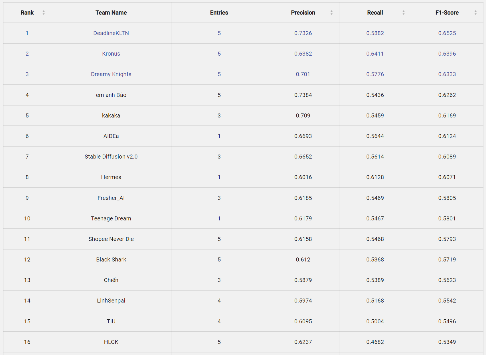
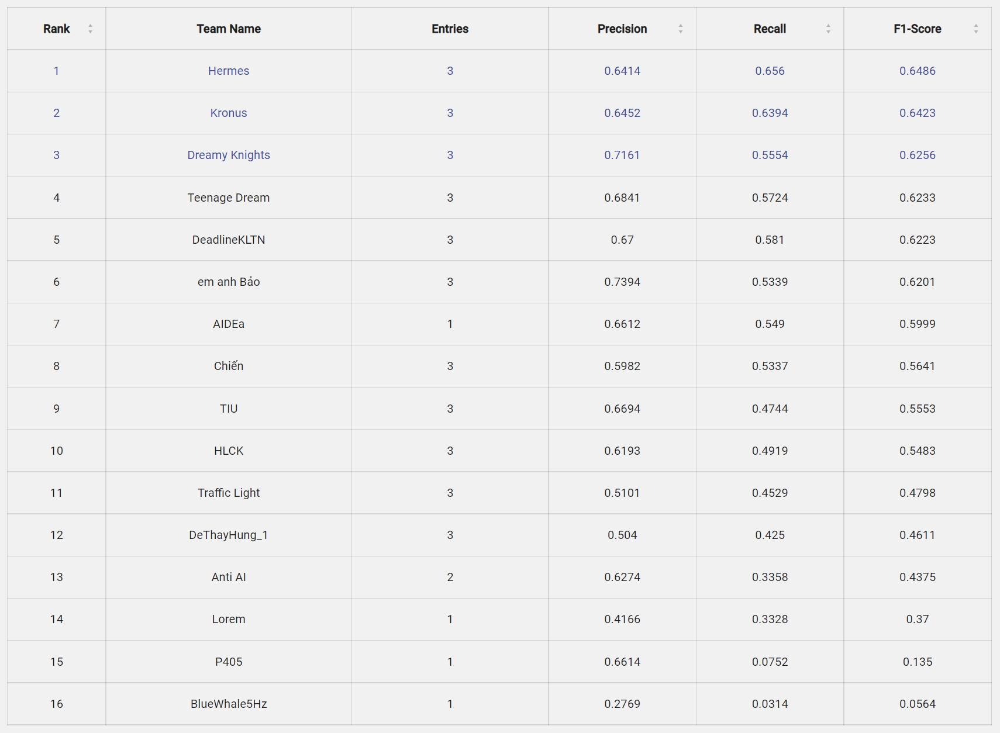
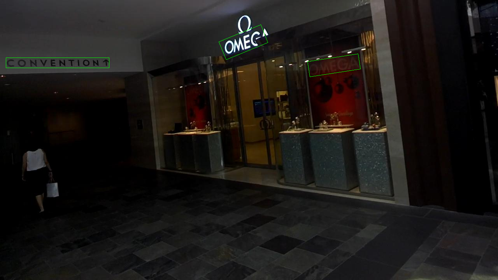

# E2E_WordArt_DetRec
End2End pipeline for WordArt Text Detection and Recognition (Eng-Vie)

The pipeline is implemented for UIT-AIChallenge2022 consisting of text detection and text recognition. 
* For detection we use the Mask R-CNN (ResNext101-DCNv2_pretrainedImageNet, finetune ICDAR+WordArt) for precise segmentation. 
* For Recognition we use the VGG_Transformer for accurate OCR. 

Our pipeline achieves State-of-the-art performance reaching top-3 in the public test with the F1 score of 63.33 and 62.56 on private test 

(Team: Dreamy Knights)
<p>
  
</p>

## Contributors
| Serial | Full name              | Github                                               | Email                   |
| ------ | ----------------------:|-----------------------------------------------------:|-------------------------:
| 1      | Nguyễn Đức Anh Phúc |[PhucNDA](https://github.com/PhucNDA)          |phucnda@gmail.com   |
| 2      | Ngô Văn Tấn Lưu |[tanluuuuuuu](https://github.com/tanluuuuuuu)          |20521591@gm.uit.edu.vn   |
| 3      | Huỳnh Viết Tuấn Kiệt |[hiimking1509](https://github.com/HiImKing1509)          |20521494@gm.uit.edu.vn   |
| 4      | Lê Việt Thịnh |[levietthinh](https://github.com/levietthinh)          |vietthinh101@gmail.com   |
| 5      | Trương Thành Thắng |[erwin24092002](https://github.com/erwin24092002)          |20521907@gm.uit.edu.vn   |

## Figures
<p>
  
</p>
* KHUYÊN-NGUYỄN
<p>
    
</p>

* CONVENTION-OMEGA-OMAGA

* SaleOff-XẢ-XẢ-THU-173-CHƯA-XẢ-100K-HÀNG-XẢ-BUỒN-ĐỒNG-10-120K-CỰC-SỐC-GIÁ-....
<p>
    
</p>

* trò-tiệm

* SALE-SALE-Collectpoint
# Environment Setup
```python 
conda create -n E2EWordArtDetRec python=3.8 pytorch=1.10 cudatoolkit=11.3 torchvision==0.11.0 -c pytorch -y
conda activate E2EWordArtDetRec
!pip install mmdet==2.25.0
!pip install mmcv==1.6.0
# Install locally mmocr==0.6.3
%cd mmocr
!pip install -v -e .
%cd ../
# Install from pip for testing
!pip install --quiet vietocr
# Some rotation augmentation added in here
!pip install mmrotate
# For training, install locally from this source
%cd vietocr
python setup.py
```
# Data pre-processing

## Text Detection
For the detection task, we provide the data conversion from json to ICDAR2015 .txt style

The json dictionary format for each image polygon (multiple vertices):
```python
[
# Vietnamese encoder 
  {
    "text": "\u00d4",
    "points": [
      [52, 59],
      [228, 59],
      [228,262],
      [52,262]],
    "isArt": false
  },
# Unlabeled text   
  {
    "text": "###",
    "points": [
      [52, 59],
      [228, 59],
      [234, 62],
      [256, 65],
      [278, 66],
      [228,64],
      [52,262]],
    "isArt": false
  },
]
```


We interpolate multiple vertices polygon into 4 vertices polygon for easy segmentation

The .txt text ICDAR2015 style format for each image polygon (4 vertices):
```python
228,58,51,58,51,262,227,262,Ô
891,47,279,27,269,299,881,319,KÌA!
```
In order to change the annotation to ICDAR2015 (including interpolating the muti-vertice polygon and cleaning for unlabeled text), proceed the following code
```python
python tools/data_converter.py --label_root <root_anno_labels> --label_des <converted_output_anno_labels>
```
Ensuring the right data tree format

    Home
    ├── Dataset
    │   ├── images
    │   │   ├── training
    │   │   ├── validation
    │   │   ├── testing
    │   ├── labels
    │   │   ├── training
    │   │   ├── validation
    │   │   ├── testing

After having converted to the ICDAR2015, we will use the configuration of MMOCR+MMDetection to train the text detector using the COCO format. We also provide the conversion to COCO format:
```python
python tools/convert_annotation.py --image_path Dataset/images --gt_path Dataset/labels --out-dir Dataset/json_converted --dataset icdar2015 --split-list training
python tools/convert_annotation.py --image_path Dataset/images --gt_path Dataset/labels --out-dir Dataset/json_converted --dataset icdar2015 --split-list validation
python tools/convert_annotation.py --image_path Dataset/images --gt_path Dataset/labels --out-dir Dataset/json_converted --dataset icdar2015 --split-list testing
```
Desired outcome

    Home
    ├── Dataset
    │   ├── images
    │   │   ├── training
    │   │   ├── validation
    │   │   ├── testing
    │   ├── labels
    │   │   ├── training
    │   │   ├── validation
    │   │   ├── testing
    │   ├── json_converted
    │   │   ├── instances_training.json
    │   │   ├── instances_validation.json
    │   │   ├── instances_testing.json

## Text Recognition
Crop the bounding boxes out as your wish. Modifying your datatree
    
    vietocr
    ├── data
    │   ├── images
    │   │   ├── 1.png
    │   │   ├── 2.png
    │   │   ├── ...
    │   │   ├── 3.png
    │   │   ├── annotation.txt
    
The annotation.txt folows the format of (No 2 words per image):
```python
data/images/1.png Ford
data/images/2.png PARA
data/images/3.png JUNIPER
data/images/4.png TABLE
...
```
# Training   
## Text Detection
```python
cd mmocr
python tools/train.py ./configuration/maskrcnn_resnext101_DCN_160e_icdar
```
## Text Recognition
We must prepare for the pretrained Vietnamese weights [weights](https://drive.google.com/file/d/13327Y1tz1ohsm5YZMyXVMPIOjoOA0OaA/view?usp=sharing):

    vietocr
    ├── weights
    │   ├── transformerocr.pth

Run the following code, modifying hyper-params in train.py:
```python
cd vietocr
python train.py
```
After running following comand, it will automatically convert data format to .lmdb and train your model

# Testing
To run end2end testing model, run the following line:
```python
python e2e_inference.py --config 'configuration/maskrcnn_resnext101_DCN_160e_icdar.py' --det_weights <detection_weights> --rec_weights <recognition_weights> --input_images <input_images_directory> --output_destination <output_directory> 
```
For instance:
```python 
python e2e_inference.py --config 'configuration/maskrcnn_resnext101_DCN_160e_icdar.py' --det_weights '../work_dirs/maskrcnn_resnext101_DCN_160e_icdar_btc/epoch_150.pth' --rec_weights '../vietocr/weights/transformerocr_btc.pth' --input_images '../AIC/uaic2022_public_valid/images' --output_destination 'temporary' 
```
Detection training [Det weights](https://drive.google.com/file/d/1sFvpN_lhEWBjkkjcvokp7JgPPn-S_YuK/view?usp=share_link)

OCR training [OCR weights](https://drive.google.com/file/d/1ePhYVpUtOVGUv6F6gtUqBEijZD2dZd4M/view?usp=share_link)

It will automatically localize text and crop them out for OCR, output will be a list of txt files containing:
```python
4,41,144,41,144,8,4,8,MUA
241,47,397,47,397,14,241,14,TẶNG
```
After running the output data tree will be:

    Home
    ├── temporary
    │   ├── predicted
    │   │   ├── im0001.txt
    │   │   ├── im0002.txt
    │   │   ├── ...
    │   ├── out_im0001.json
    │   ├── out_im0001.png
    │   ├── out_im0002.json
    │   ├── out_im0002.png    
    │   ├── ...      
    
You might want to change the detection threshold. The threshold is 0.8 by default
